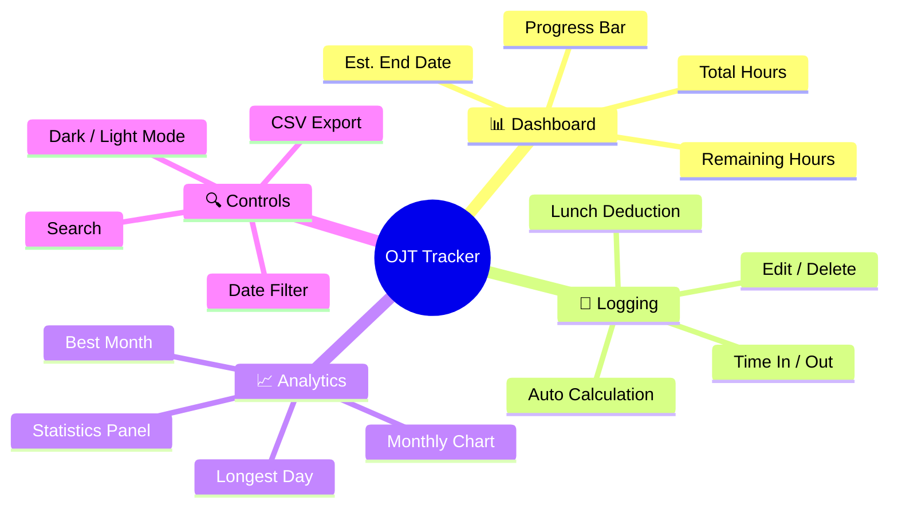
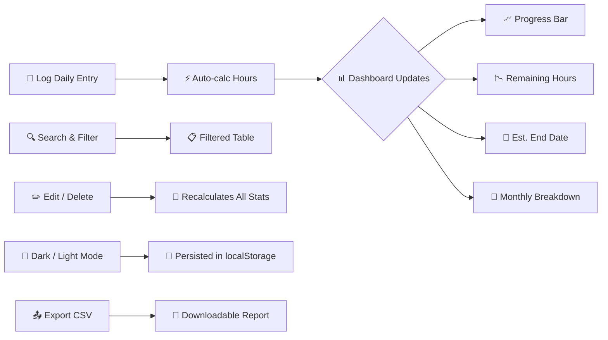
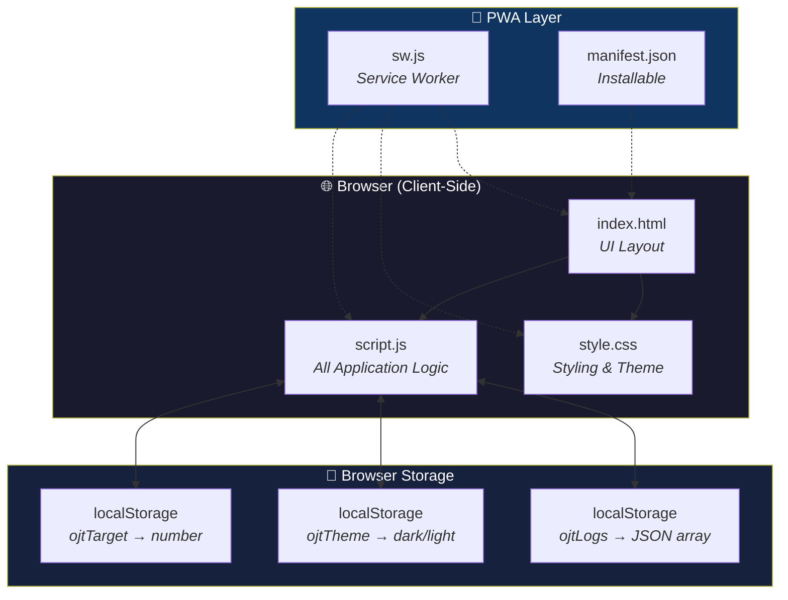
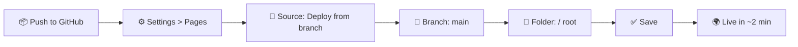
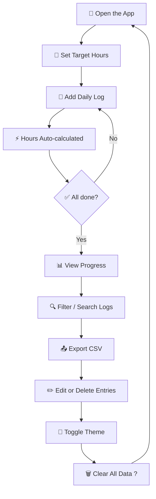
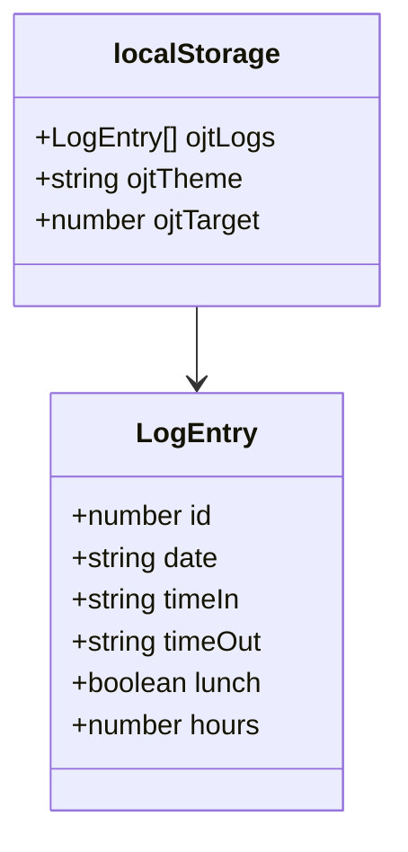
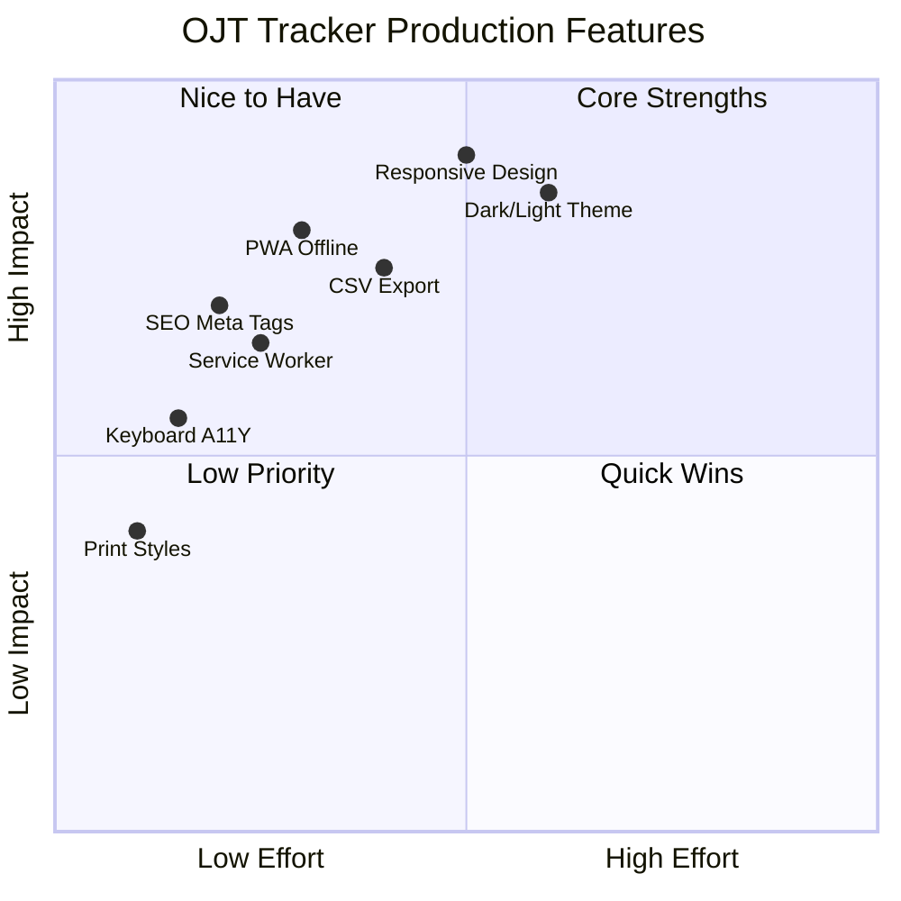

<div align="center">

# ⏱ OJT Tracker

*A clean, client-side progress tracker for on-the-job training hours.*

[Features](#-features) • [Architecture](#-architecture) • [Getting Started](#-getting-started) • [Usage](#-usage) • [Data Model](#-data-model) • [Production](#-production-ready)

---


</div>

---

## 🧠 What is OJT Tracker?

> A single-page web app for students to **log daily attendance**, **track progress** toward their training hour target, and **export records** — all in the browser with zero setup.



---

## ✨ Features



| Feature | Why it matters |
|---|---|
| **Live Dashboard** | See total hours, remaining, progress %, and estimated end date at a glance |
| **Customizable Target** | Defaults to 500 hrs — adjust from 1–9999 to match your program |
| **Daily Time Logs** | Log time-in, time-out, and optionally deduct 1-hour lunch |
| **Monthly Breakdown** | Visual bar chart + table of hours per month |
| **Statistics Panel** | Total days logged, avg hrs/day, best month, longest day |
| **Search & Filter** | Filter by date range or search across all entries |
| **CSV Export** | One-click download of all logs for reporting |
| **Dark / Light Theme** | Toggle and persist your preference |

---

## 🏗 Architecture



| Layer | Technology |
|---|---|
| **UI** | HTML5 + Vanilla CSS3 (custom properties, animations, glassmorphism) |
| **Logic** | Vanilla ES6+ JavaScript — zero frameworks, zero dependencies |
| **Storage** | Browser `localStorage` — no server, no database, no API |
| **Fonts** | Google Inter (400–800) |
| **Icons** | Inline SVGs |
| **PWA** | Service worker + Web App Manifest |

---

## 🚀 Getting Started

### Run Locally

```bash
git clone https://github.com/rjanciro/OJT-Tracker.git
cd OJT-Tracker
start index.html
```

No `npm install`. No build step. Just open and go.

### Deploy to GitHub Pages



Your site will be live at `https://<username>.github.io/<repo-name>/`.

> Includes a **service worker** for offline caching and a **manifest.json** for Add to Home Screen on mobile.

---

## 🎯 Usage



1. **Set your target** — Adjust the "Target Hours" field to your required hours (e.g., 500, 750, 1000).
2. **Add a log** — Enter date, time-in, time-out, toggle lunch deduction. Hours are auto-calculated.
3. **Edit / Delete** — Click the pencil or trash icon on any row.
4. **Filter** — Use date range pickers or search box above the log table.
5. **Export** — Click "Export CSV" to download your records.
6. **Toggle Theme** — Click the sun/moon icon in the header.

---

## 💾 Data Model



Every log entry is stored as a JSON object in `localStorage` under `ojtLogs`:

```json
{
  "id": 1717500000000,
  "date": "2025-06-04",
  "timeIn": "7:00 AM",
  "timeOut": "4:00 PM",
  "lunch": true,
  "hours": 8
}
```

Additional keys:

| Key | Type | Description |
|---|---|---|
| `ojtTarget` | `number` | Target hours (default 500) |
| `ojtTheme` | `"light"` or absent | Theme preference |

---

## 🏭 Production Ready



- **📱 PWA Ready** — Service worker caches assets for offline access; installable via manifest.
- **🔍 SEO Optimized** — Meta tags, Open Graph tags, and semantic HTML structure.
- **♿ Accessible** — Focus-visible outlines, `prefers-reduced-motion` support.
- **📐 Responsive** — Fully functional on desktop, tablet, and mobile.
- **🖨 Print Friendly** — Optimized print styles for generating paper records.
- **⚡ Performance** — CSS preloaded, search debounced, animations hardware-accelerated.

---

## 📄 License

Distributed under the MIT License.

---

<p align="center">
  Created with ❤️ by <a href="https://github.com/rjanciro">rjanciro</a>
</p>
